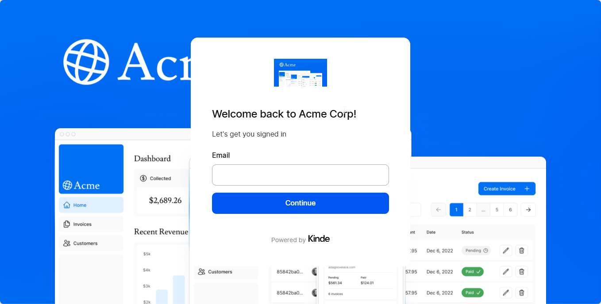

# Finance Corporation Invoice Tracker

This is a finance corporation invoice tracker application built using Next.js, TypeScript, Tailwind CSS, and Kinde Auth. It is a prototype project built on the nextjs learn course to showcase how businesses can manage invoices and track their revenue.

## Additional Features

- Authentication with Kinde Auth
- Revenue update
- Monthly revenue calculation
- Dynamic Revenue chart rendering

## Technologies Used

- Next.js
- TypeScript
- Tailwind CSS
- PostgreSQL (Supabase)
- Kinde Auth

## Usage

To run the application, follow these steps:

1. Clone the repository.
2. Install dependencies using npm or yarn.
3. Create a PostgreSQL database and configure the connection string in the .env file (see .env.example).
4. Run the application using npm run dev or yarn dev.

The application will be available at http://localhost:3000.
